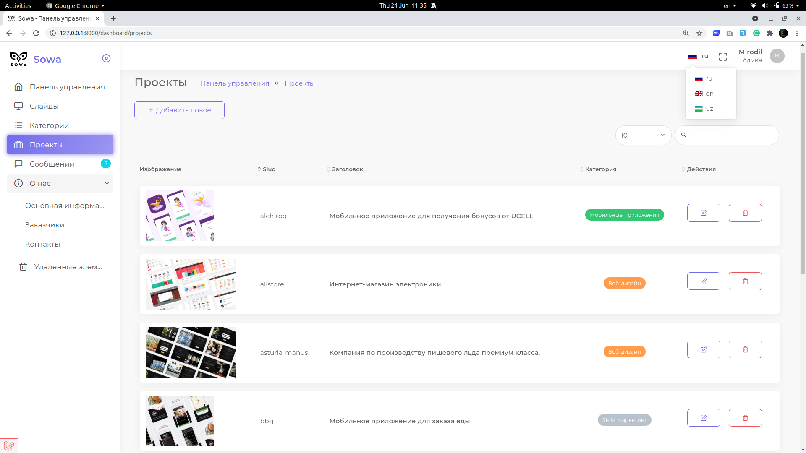

<h1 align="center">My first CRUD, multi-language application using Laravel</h1>

<p align="center"></p>

## About the project

**Sowa** is a digital agency in Tashkent, which offers various services on digital projects in any field.

Important functionalities of this application:

- Multi-language (Russian, English, Uzbek)
- Website is dynamic and can be modified by Admin
- Admin can create, update, delete and restore (some contents) interacting with user-friendly UI (dashboard)
- User can leave their contacts and messages

Database design of the application:


## How to locally host the project?

*Why it is not hosted anywhere?*
>As the application is dynamic (fully customizable), anyone can add anything that may include numerous inappropriate things. 

### Technology requirements

```json
{
    "php": "^8.0",
    "mysql": "^5.7",
    "composer": "^2.0"
}
```

If you are using Windows, you can install only [XAMPP](https://www.apachefriends.org/index.html), [Composer](https://getcomposer.org/) and you are good to go.

First of all, clone this repository

```bash
git clone https://github.com/mirodil1999/sowa.git

cd sowa
```

Install all the dependencies

```bash
composer install
```

Create new database and configure the application. You can create database from [phpMyAdmin](http://localhost/phpmyadmin/) or from terminal/cmd

```bash
mysql -u db_user -p

CREATE DATABASE sowa;
```

Where `db_user` is your actual database user (most cases it is `root`) and type your password (if any)

Now search `.env.example` file from the directory you cloned the application. If cannot find it, you can [download](https://raw.githubusercontent.com/mirodil1999/sowa/main/.env.example) and paste it to the directory (where the README located)

Rename this `.env.example` file to `.env` and edit following contents:

```dotenv
DB_DATABASE=sowa
DB_USERNAME=your database username
DB_PASSWORD=your database password
```

Now you finished all the configuration, and you can fill the tables with some testing data by

```bash
php artisan migrate:fresh --seed
```

Now you may start Laravel's local development server

```bash
php artisan serve
```

http://127.0.0.1:8000/dashboard is the URL for the dashboard. Here is the admin credentials:

```
mirodil@gmail.com
Admin123
```

For those who read so far, I really want to share these two articles:

- [4 Mistakes I Made as a Programmer, but I Had To Become a CTO To See Them](https://medium.com/@kubut/4-mistakes-i-made-as-a-programmer-but-i-had-to-become-a-cto-to-see-them-19a41ba70411)

- [Programmers, Stop Thinking About Yourself as an Artist — You’re an Architect](https://betterprogramming.pub/programmers-stop-thinking-about-yourself-as-an-artist-youre-an-architect-e4d415142dce)


